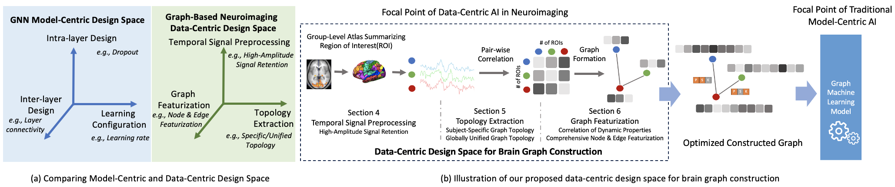

<h1 align="center"> Enhanced Brain Graph Construction in Neuroimaging: <br> A Data-Centric AI Approach </h1>

<p align="center">
  <a href="">
    
  </a>
  <a href="https://github.com/GeQinwen/DataCentricBrainGraphs">
    
  </a>
  <a href="https://github.com/GeQinwen/DataCentricBrainGraphs/blob/main/LICENSE">
    
  </a>
</p>

## Introduction

This repository hosts the resources for the paper *[Enhanced Brain Graph Construction in Neuroimaging: A Data-Centric AI Approach]()*.

The construction of brain graphs from functional Magnetic Resonance Imaging (fMRI) data plays a crucial role in enabling graph machine learning for neuroimaging. However, current practices often rely on rigid pipelines that overlook critical data-centric choices in how brain graphs are constructed. In this work, we adopt a Data-Centric AI perspective and systematically define and benchmark a data-centric design space for brain graph construction, constrasting with primarily model-centric prior work. We organize this design space into three stages: temporal signal processing, topology extraction, and graph featurization. Our contributions lie less in novel components and more in evaluating how combinations of existing and modified techniques influence downstream performance. Specifically, we study high-amplitude BOLD signal filtering, sparsification and unification strategies for connectivity, alternative correlation metrics, and multi-view node and edge features, such as incorporating lagged dynamics. Experiments on the HCP1200 and ABIDE datasets show that thoughtful data-centric configurations consistently improve classification accuracy over standard pipelines. These findings highlight the critical role of upstream data decisions and underscore the importance of systematically exploring the data-centric design space for graph-based neuroimaging.

---

<p align="center">
  
</p>

## Data-Centric Design Space

**1) Signal Processing**
- **High-amplitude retention**: emphasize salient BOLD fluctuations and suppress low-amplitude noise.

**2) Topology Extraction**
- **Connectivity metrics**: Pearson, Spearman, Kendall.
- **Unified topology**: a population-level edge set enforced across subjects for consistent structure.

**3) Featurization**
- **Dynamic (lagged) connectivity**: capture temporal dependencies via lagged correlations.
- **Multi-view features**: concatenate P/S/K and lagged views for nodes; add binary edge indicators for P/S/K.

> We systematically benchmark these choices and their combinations across datasets, ROI scales, and GNN backbones.

---

## Data Preparation

This project uses two public datasets:

### 1. Human Connectome Project (HCP S1200)
- [Official website](https://www.humanconnectome.org/study/hcp-young-adult/document/1200-subjects-data-release)
- Resting-state (1,078 subjects) and task-based (>7,000 scans)
- Preprocessed using HCP Minimal Preprocessing Pipeline
- Parcellated with Schaefer atlas (ROI=100, 400, 1000)

Get your AWS keys from HCP ConnectomeDB: [https://db.humanconnectome.org](https://db.humanconnectome.org)
Then run (replace the empty quotes with your keys):

**HCP Rest:**
`python download_hcp_rest.py --root data --name HCPGender --threshold 5 --path_to_data data/raw/HCPGender --n_rois 100 --n_jobs 1 --access_key "" --secret_key ""`

**HCP State:**
`python download_hcp_state.py --root data/state_100 --name HCPState --threshold 5 --path_to_data data/raw/HCPState --n_rois 100 --n_jobs 1 --access_key "" --secret_key ""`

> Note: Large downloads and long runtimes; these commands are example usage.

### 2. Autism Brain Imaging Data Exchange (ABIDE)
- [Official website](http://fcon_1000.projects.nitrc.org/indi/abide/)
- Resting-state (1,009 subjects)
- Preprocessed using C-PAC pipeline
- Parcellated with Schaefer atlas (ROI=200, 400)

`python download_abide.py --root data --name ABIDE --threshold 5 --path_to_data data/raw/ABIDE --n_rois 200 --n_jobs 1 --pipeline cpac --download true`

---

### Reproducing the Data-Centric Design Space

To explore **all methods and configurations** evaluated in the paper, please check the code under `src/`:

* `src/preprocessing/`: High-amplitude retention for BOLD signals
* `src/topology/`: Pearson/Spearman/Kendall graph construction and unified topology
* `src/featurization/`: lagged correlation features and edge-featurization
* `examples/`: end-to-end training example on processed `.pt`

Each script exposes a consistent CLI (run `python <script>.py --help`) and includes **usage examples in the header docstring**.

If anything is unclear or you hit issues, feel free to reach out: **[qinwen.ge@vanderbilt.edu](mailto:qinwen.ge@vanderbilt.edu)**.


## Citation

If you use our work, please cite:

```bibtex

```
